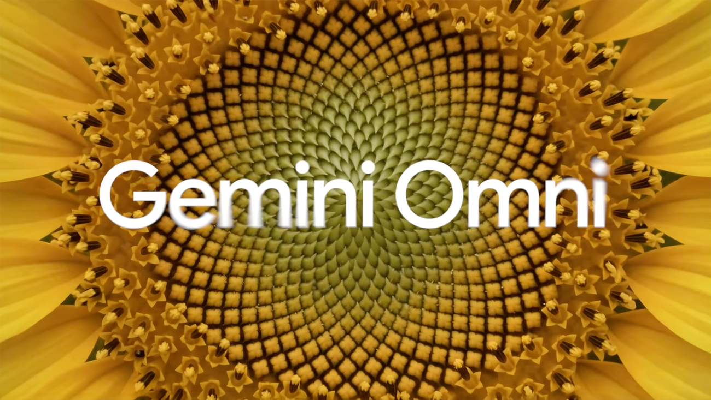

# Awesome Gemini Omni 

  

Gemini Omni is Google's next-generation, natively multimodal AI model capable of seamlessly processing and generating text, code, images, audio, and video. The Gemini Omni Flash model is also officially available to try directly in the [Gemini App](https://gemini.google.com/).

## Contents

- [Official Resources](#official-resources)
- [Interactive Platforms](#interactive-platforms)
- [Capabilities and Showcases](#capabilities-and-showcases)
- [Tutorials and Courses](#tutorials-and-courses)

## Official Resources

- [Official Product Page](https://deepmind.google/models/gemini-omni/) - Official overview of the Gemini Omni model architecture, native multimodality, and core features.
- [Prompt Guide](https://deepmind.google/models/gemini-omni/prompt-guide/) - Official comprehensive guidelines by Google DeepMind for designing effective multimodal prompts.
- [Model Card](https://deepmind.google/models/model-cards/gemini-omni-flash/) - Official model card outlining technical specifications, training datasets, and safety mitigations for Gemini Omni Flash.
- [Veo Prompt Guide](https://deepmind.google/models/veo/prompt-guide/) - Official guidelines by Google DeepMind for crafting high-fidelity video generation prompts in Veo.
- [Ultimate Prompting Guide for Veo 3.1](https://cloud.google.com/blog/products/ai-machine-learning/ultimate-prompting-guide-for-veo-3-1) - In-depth prompt engineering and styling handbook from the Google Cloud blog for Veo 3.1.

## Interactive Platforms

- [Google Flow](https://flow.google/) - Creative canvas and workspace enabling interactive collaboration and native video editing powered by Gemini Omni.

## Capabilities and Showcases

### Native Video Editing & Scene Manipulation

#### Object Insertion & Substitution (Inpainting)

- [Showcase by CHOI (@arrakis_ai)](https://x.com/arrakis_ai/status/2059643015866761471) - Gemini Omni turned me into the owner of a $5 million Pokémon card.
- [Showcase by CHOI (@arrakis_ai)](https://x.com/arrakis_ai/status/2059875894991466867) - Holy... Gemini Omni actually made me the owner of a Lamborghini.
- [Showcase by fofr (@fofrAI)](https://x.com/fofrAI/status/2060453558764339474) - A quick test of using Omni to edit a video and add labelled bounding boxes around objects. > Add a labelled bounding box around the monster truck and the flag.
- [Showcase by Hirokazu Yokohara (@Yokohara_h)](https://x.com/Yokohara_h/status/2060052885132722672) - 撮影した郵便ポストの動画をGoogle Omniで色々と変更っていうテストしてた 近頃はどの動画生成もトラッキングとか合成なしで色々編集出来るようになってきてるね わずかにズレたり劣化するのはどうにかして欲しい.

#### Background Replacement & Environment Swapping

- [Showcase by Alex Patrascu (@maxescu)](https://x.com/maxescu/status/2058790153569869972) - Add anyone to the Backrooms with Gemini Omni. Prompt: Keep the subject&#x27;s motion and timing exact. Place the subject in the Backrooms: yellow patterned wallpaper, damp musty carpet, low ceiling, identical fluorescent panels overhead, the space extends in every direction without.
- [Showcase by Riccardo Wolf (@WolfRiccardo)](https://x.com/WolfRiccardo/status/2059324538677244033) - Gemini Omni 🤓 Prompt: Place the woman (ref vid) realistically into these locations(*). Never change the angle, framing, the woman, or the woman’s pose. Never zoom in, never zoom out. Keep exactly the same angle and the same framing. (just---chng outfit). * Museum - 1click *.
- [Showcase by ZeFred.AI (@ZefredAi)](https://x.com/ZefredAi/status/2060051677323915670) - Round 2 with Gemini Omni. 🎬 This time, I tested identity consistency through pure absurdity. 20 extreme environments, 20 completely mismatched jobs. A corporate suit in the Amazon, a lifeguard in the Sahara, and a knight in the London Underground. Master prompt is in the.

#### Material, Color & Style Alteration

- [Claymation and Anime Style Transfer](https://x.com/jerrod_lew/status/2057100280672739525) - Video style alteration example showing adjustment into anime or claymation while preserving spatial motion.
- [LEGO and Historical Film Transfer](https://x.com/emollick/status/2057874739817808223) - Demonstration of transforming the famous 1896 train film into LEGO style and adding custom elements natively.
- [Material Synthesis and Modification](https://x.com/alexanderchen/status/2057176690519089166) - Native material transformation using combined text prompts and video inputs.
- [Showcase by Alexander Chen (@alexanderchen)](https://x.com/alexanderchen/status/2059236368832708639) - Gemini Omni 🕶️ prompt in 🧵.
- [Showcase by Alexander Chen (@alexanderchen)](https://x.com/alexanderchen/status/2060322611586834518) - Gemini Omni 🐦 prompt in 🧵.
- [Showcase by AshutoshShrivastava (@ai_for_success)](https://x.com/ai_for_success/status/2057495182275383796) - My first Gemini Omni Flash generation 🐶 ➕ 🐙.
- [Showcase by fofr (@fofrAI)](https://x.com/fofrAI/status/2060389129850933482) - > Make it unhinged 90s anime and a cybernetic arm. No embellishments, no neon, no sparks, keep it raw. Like it&#x27;s a hand being used for the first time. Atmospheric.
- [Showcase by Sam Sheffer (@samsheffer)](https://x.com/samsheffer/status/2059338260078289173) - Omni continues to blow my mind (left original / right generated) waymo looks sick in matte black.
- [Video-to-Video Style Alteration](https://x.com/SJinn_Agent/status/2057387115617603990) - Native video editing test demonstrating high-fidelity video style adjustments.

#### VFX & Interactive Scene Editing

- [Dynamic Logo and Text Tracking](https://x.com/nmatares/status/2057592367444840861) - Showcase of placing high-fidelity text at precise timestamps and rendering logos onto fast-moving tennis balls in Google Flow.
- [Showcase by CHOI (@arrakis_ai)](https://x.com/arrakis_ai/status/2058128510611488775) - I’m getting serious “Nano Banana” moments from Gemini Omni. Makes me excited to see just how much better this is going to get in the future.
- [Showcase by Jerrod Lew (@jerrod_lew)](https://x.com/jerrod_lew/status/2061119586226020585) - Google Gemini Omni is great for VFX. Film anything on your phone and upload it to Google Flow. Select Omni Flash and insert a prompt to direct what happens in the scene. Try to give as much specific details as you can. Have left the prompt used for this video in the comments!.
- [Showcase by Jerrod Lew (@jerrod_lew)](https://x.com/jerrod_lew/status/2059983245320802475) - Create anything with Google Gemini Omni Flash. On Google Flow the new model lets you reference videos to make adjustments and edits. Change the environment, clothes and even add/remove objects all whilst keeping consistency of character and scene.
- [Showcase by Marco (@ai_artworkgen)](https://x.com/ai_artworkgen/status/2060322372599587206) - Google Gemini Omni is SO MUCH FUN! With simple prompts, you can edit a starting video to create so many iterations. Super!.
- [Showcase by René Remsik (@aitrendz_xyz)](https://x.com/aitrendz_xyz/status/2060020243804660105) - Gemini Omni really shocked me with its quality. You can literally do Zach King level video tricks thanks to AI now! Just record your video, upload it to Omni and type your prompt. No limits, full creativity. Good job @Google @GoogleDeepMind @GeminiApp on this one 🤌 Thanks.
- [Showcase by Rourke Heath (@rourke_heath)](https://x.com/rourke_heath/status/2058994443022385376) - Google Gemini Omni is widely underrated 🔥 Try Omni on Google flow today @googlegemini @google @googledeepmind Gemini Omni lets you edit video and images through plain conversation, reshaping scenes, swapping objects, changing angles and actions while keeping characters and.
- [Showcase by Sam Sheffer (@samsheffer)](https://x.com/samsheffer/status/2060437192019685380) - Super saiyan omni look at the reflection also how sick is that mullet.

#### Video Outpainting & Expansion

- [Showcase by Greenfield Team! (@Team_Greenfield)](https://x.com/Team_Greenfield/status/2059835570566963378) - Cool video outpainting results with Gemini Omni.

### Path Control & Motion Synthesis

#### Map-to-Video Generation

- [Showcase by CHRIS FIRST (@chrisfirst)](https://x.com/chrisfirst/status/2057612088651252062) - I uploaded a screenshot of Google Maps to Gemini Omni with a route drawn on it. Then I prompted it to create a first person view of someone driving a taxi cab along the route in the reference image. Pretty close to the real thing.
- [Showcase by TechHalla (@techhalla)](https://x.com/techhalla/status/2059724218158166537) - I asked Gemini Omni to take me across the Middle Earth 🐴 All I needed was a map (as image input) and this prompt 👇 Analyze the location and direction of the arrow on the attached map. remove the red arrow. Create a virtual tour guide video showing the 2 most important.

#### Sketched Path & Camera Control

- [High-Speed Camera Zoom and World Knowledge](https://x.com/fofrAI/status/2056793826401140948) - High-speed camera panning, zoom, and refocus simulation demonstrating deep spatial world knowledge in Gemini Omni Flash.
- [Showcase by Bilawal Sidhu (@bilawalsidhu)](https://x.com/bilawalsidhu/status/2059419767417487718) - Gave google omni a sketched camera path and asked it to generate drone POV footage.
- [Showcase by Larus Canus (@MrLarus)](https://x.com/MrLarus/status/2060268998932000987) - 🤯一个控制 AI 航拍镜头的新玩法！ 直接在图片上画线， 让 AI 按红线生成无人机镜头💥 我做了一段广州中轴线 FPV 航拍： 低空穿过花城广场 → 贴楼拔高 → 穿楼顶结构 → 绕楼俯冲 → 掠过珠江 → 冲向小蛮腰 → 绕塔上升 城市航拍、景区穿越、商业地产、楼宇宣传片…全都能这么玩！.

### Digital Humans & Multimodal Pipelines

#### Avatars & Likeness Cloning

- [Showcase by Google Gemini (@GeminiApp)](https://x.com/GeminiApp/status/2056869837511545328) - Create videos with your own voice and likeness using avatars with Gemini Omni. When you create an avatar, you have an AI digital version of yourself so you can easily generate videos that look and sound like you. No need to upload your image every time.

#### Translation & Lip-Sync

- [Showcase by Carlos Santana (@DotCSV)](https://x.com/DotCSV/status/2059676610400231599) - Sigo jugando con Omni! Efectivamente el modelo desbloquea un montón de casos de uso (e.g. traducción) que antes requerían de concatenar varios modelos diferentes: Traducción → Voz cloning → Avatar lip-syncing... Ahora todo se reduce a un prompt.
- [Showcase by László Gaál (@laszlogaal_)](https://x.com/laszlogaal_/status/2058852177163272458) - New day now Omni findings: it can translate audio (no original or translated text given in the prompt): - it keeps the background music intact - it adjusts the edit if needed. For example the japanese and spanish sentence during the creme close-up shot is longer, so it kept that.

### Educational, Explainer & Information Synthesis

#### Scientific & Concept Animation

- [Showcase by Chetaslua (@chetaslua)](https://x.com/chetaslua/status/2056676690051662193) - Gemini Omni explains science with video ...... holy shit @demishassabis @OfficialLoganK thanks a lot for this , now every student will get there custom video for there topic of science and math I am so happy like while typing i want to see all of your reaction to this , this.
- [Showcase by Fandu (@mrfanduuuuu)](https://x.com/mrfanduuuuu/status/2056692235174097398) - Gemini Omni made me this video to explain photosynthesis👀 Google is wining hard 🔥 link:.

#### Anatomy & Technical Visuals

- [Showcase by fofr (@fofrAI)](https://x.com/fofrAI/status/2059686555598397881) - > Make this an anatomy demo, showing how the bones and muscles move when the hand moves.

#### World Knowledge & Geo-Spatial Reasoning

- [Showcase by László Gaál (@laszlogaal_)](https://x.com/laszlogaal_/status/2060403584026734779) - Google Omni passes the GPS coordinate test too: "Create a video of the major event that happened at these coordinates: 41°43′32″N 49°56′49″W.".

### Artistic, Architectural & Professional Showcases

#### 3D Consistency & Creative Art

- [Showcase by Martin Nebelong (@MartinNebelong)](https://x.com/MartinNebelong/status/2059726619451785641) - Omni feels like magic 🤩.

#### Spatial & Architectural Design

- [Showcase by Ian Curtis (@XRarchitect)](https://x.com/XRarchitect/status/2059509713923158221) - My first Omni test. It’s really cool.

#### Fashion & E-commerce Style Testing

- [Showcase by 小宇Chengzi (@Chengzilhy)](https://x.com/Chengzilhy/status/2059954858271420724) - AI is getting scary good at fashion videos. 这组辣妹风穿搭视频， 从造型、动作到镜头氛围，已经越来越接近真实短视频质感了。 以前做女装内容要模特、场地、摄影、剪辑。 现在 AI 可以先把视觉方向跑出来，直接测试哪套更吸睛。 For fashion brands, this is not just content. This is a new.

### Reviews & Deep Dives

#### Comprehensive Evaluations

- [Showcase by Invideo (@invideoOfficial)](https://x.com/invideoOfficial/status/2060387935359549947) - Google’s new model Omni is here. It does video, avatars, inpaint, lip sync, and a bunch more, all in one. I spent a day running 30+ tests to figure out what it can do, where it breaks, and whether it&#x27;s actually production-ready. The unlocks, the ceilings, the specs - full.

#### Quality & Consistency Analysis

- [Showcase by Chubby♨️ (@kimmonismus)](https://x.com/kimmonismus/status/2059752505031135323) - I just watched the clip @arrakis_ai created and I&#x27;m really impressed with Google&#x27;s Omni. You can pause the clip at any frame and the text on the Pokémon card remains perfectly legible and unaltered. The consistency and continuity are next level.

### General & Multimodal Generation

#### Multimodal Combinations

- [Showcase by A.I.Warper (@AIWarper)](https://x.com/AIWarper/status/2058930629836951763) - So close.... Google Omni.
- [Showcase by Google (@Google)](https://x.com/Google/status/2056786781992071172) - Gemini Omni can create anything from any input, starting with video. 🪄 This means you can combine images, audio, video and text as input and generate high-quality videos. Or use drawings to create in a way that matches your vision. #GoogleIO.
- [Showcase by Google Gemini (@GeminiApp)](https://x.com/GeminiApp/status/2059663425580695564) - Add text, video, or up to five images as your ingredients and Gemini Omni can combine them all into one cohesive ten-second video. Try it today and share your creations in the replies. 👇.
- [Showcase by Sam Sheffer (@samsheffer)](https://x.com/samsheffer/status/2056820022144905380) - I don’t think you understand how insane omni is.
- [Showcase by Sam Sheffer (@samsheffer)](https://x.com/samsheffer/status/2059356565073772586) - Gemini omni: it’s a great model sir.
- [Single-Line Video Generation](https://x.com/yurunbo/status/2057292947889250642) - Streamlined generation using ultra-compact single-line prompts.
- [Visual Question Answering and Object Identification](https://x.com/shlomifruchter/status/2057289853336011224) - Interactive identification and reasoning of dynamic real-world objects.

## Tutorials and Courses

- [AI Agents for Image and Video Generation](https://www.deeplearning.ai/courses/ai-agents-for-image-and-video-generation) - Short course focused on building AI agents that automatically generate and refine media outputs.

## Contributing

Contributions are always welcome! Please read the [contribution guidelines](CONTRIBUTING.md) first.

## Footnotes

- This repository is curated and maintained by [Chouaieb Nemri](https://github.com/cnemri/).
- Read more articles and insights by Chouaieb Nemri on [Medium](https://nemri.medium.com/).
